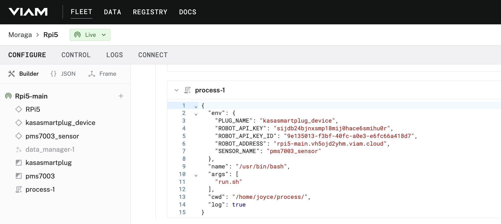

## PMS-7003 air quality sensor

Check if PM2.5 particulate values exceed unhealthy thresholds.
- If readings exceed the threshold, turn on the Kasa smart plug.
- If readings fall below the threshold, turn off the Kasa smart plug.

The Kasa smart plug can then power on / off an air filter, notification mechanism, or trigger a separate automation.

### Configure a process to run on your device

Follow step-by-step instructions in the [Viam docs](https://docs.viam.com/configure/processes/).
- Create a directory, for example called `process`, on your device to hold your code. And then, change into that directory.
    $ mkdir process
    $ cd process
- Install the Viam Python SDK and other required dependencies in this new directory.
  $ pip3 install --target=process viam-sdk
- Add your code to this directory.
  ```
  $ scp process.py user@host.local:/home/myboard/process/process.py
  ```
- Add your environment variables to the configuration JSON under the CONFIGURE tab in the Viam app.


